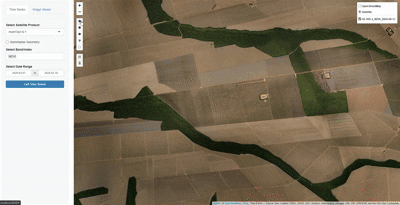

# SAT - Sistema de Análise de Terras

Este projeto é uma aplicação Shiny que permite a visualização e análise de séries temporais de dados geoespaciais. A aplicação utiliza a API WTSS (Web Time Series Service) para acessar dados de satélites e gerar gráficos interativos.

## Funcionalidades

- **Seleção de Produtos**: Permite ao usuário selecionar diferentes produtos de satélite disponíveis.
- **Visualização de Séries Temporais**: Gera gráficos interativos de séries temporais com médias, mínimos e máximos.
- **Geometrias**: Suporte para diferentes tipos de geometrias, incluindo pontos, polígonos e círculos.
- **Resumos Estatísticos**: Geração de resumos estatísticos para as geometrias selecionadas.

## Tecnologias Utilizadas

- **R**: Linguagem de programação utilizada para o desenvolvimento da aplicação.
- **Shiny**: Framework para construção de aplicações web interativas em R.
- **sf**: Pacote para manipulação de dados espaciais.
- **plotly**: Biblioteca para criação de gráficos interativos.
- **httr**: Pacote para fazer requisições HTTP à API WTSS.

## Instalação

Para instalar as dependências do projeto, execute o seguinte comando no R:

```r
install.packages(c("shiny", "plotly", "leaflet", "sf", "httr", "jsonlite", "logger", "R6"))
```

## Uso

1. Clone o repositório:

   ```bash
   git clone https://github.com/geojoao/SAT.git
   cd SAT
   ```

2. Execute a aplicação Shiny:

   ```r
   library(shiny)
   runApp("app/app.R")
   ```

3. Acesse a aplicação no seu navegador em localhost.

4. Veja a demonstração da aplicação:

   

## Testando com Docker

Para rodar a aplicação com Docker (sem precisar instalar R localmente):

1. Certifique-se de ter [Docker](https://docs.docker.com/get-docker/) e [Docker Compose](https://docs.docker.com/compose/install/) instalados.

2. Na raiz do projeto, execute:

   ```bash
   docker compose up --build
   ```

3. Acesse a aplicação no navegador em [http://localhost:3838](http://localhost:3838).

4. Para parar a aplicação, pressione `Ctrl+C` no terminal.

> **Nota:** O build da imagem pode levar alguns minutos na primeira execução, pois instala todas as dependências R necessárias.

## Estrutura do Projeto

```
/SAT
│
├── app
│   ├── app.R               # Arquivo principal da aplicação Shiny
│   └── modules             # Módulos da aplicação
│       ├── time_series_module.R  # Módulo para análise de séries temporais
│       └── image_viewer_module.R  # Módulo para visualização de imagens
│
├── wtss                     # Cliente WTSS
│   └── wtss_client.R       # Implementação do cliente WTSS
│
└── README.md               # Este arquivo
```

## Contribuição

Contribuições são bem-vindas! Sinta-se à vontade para abrir um problema ou enviar um pull request.

## Licença

Este projeto está licenciado sob a Licença MIT. Veja o arquivo [LICENSE](LICENSE) para mais detalhes.

## Contato

Para mais informações, entre em contato com [joaoneto_1612@hotmail.com](mailto:joaoneto_1612@hotmail.com).


